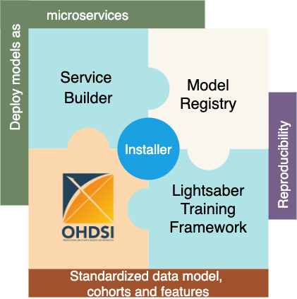
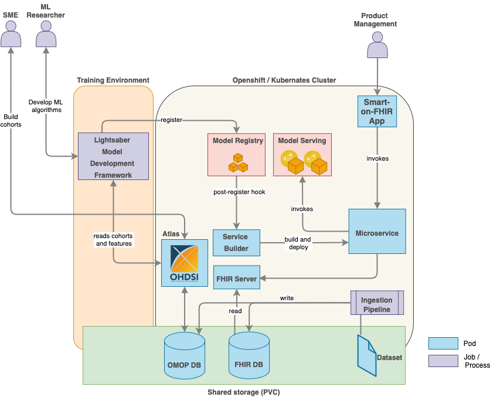
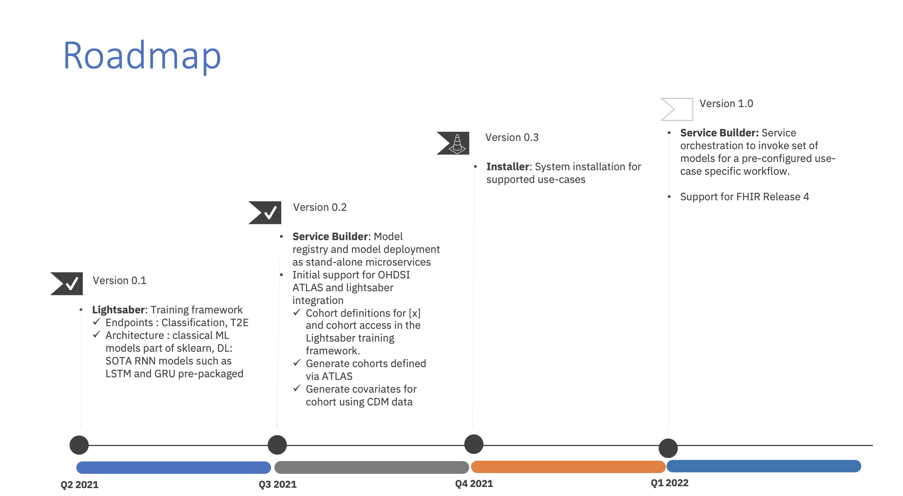

#  Overview

Disease Progression Modeling workbench 360 (DPM360) is a clinical informatics framework for collaborative research and delivery of healthcare AI. DPM360, when fully developed, will manage the entire modeling life cycle, from data analysis (e.g., cohort identification) to machine learning algorithm development and prototyping. DPM360 augments the advantages of data model standardization and tooling (OMOP-CDM, Athena, ATLAS) with a powerful machine learning training framework, and a mechanism for rapid prototyping through automatic deployment of models as containerized services to a cloud environment.

## Background

Chronic diseases are becoming more and more prevalent across the globe and are known to drive rising costs of healthcare. The health informatics community has reacted to these challenges with the development of data driven Disease Progression Modeling (DPM) techniques seeking to describe the time course of such diseases to track evolution and predict severity over time. These techniques are vast, ranging from disease staging and patient trajectory analytics, prediction and event time to event estimations for important disease related events of interests. While applications of DPM are numerous for both providers (e.g., decision support for patient care), payers (e.g., care management) and pharmas (e.g., clinical trial enrichment), the adoption of DPM is hindered by the complexity of developing and managing DPM models throughout their life cycle, from data to production. While organizations like [OHDSI](https://www.ohdsi.org/) have made huge strides to help the research community with widely adopted data models like OMOP coupled with cohorting tools like [Atlas](https://www.ohdsi.org/atlas-a-unified-interface-for-the-ohdsi-tools/), work remains to be done to provide the right platform for the complete management of DPM models. In this demonstration, we introduce Disease Progression Modeling Workbench 360 (DPM360), a work-in-progress system to address these concerns.

Building upon the ideas from our [earlier work](https://arxiv.org/abs/2007.12780), DPM360 is compatible with such OHDSI open tools while enabling health informaticians to build and manage DPM models throughout their entire life cycle within modern cloud infrastructures. DPM360 also facilitates the transparent development of such models following best practices embedded in its modeling framework, thus addressing reproducibility challenges that the AI community is facing.

## Design

DPM360 is made up of three key components. 

1. **Lightsaber**: an extensible training framework which provides blueprints for the development of disease progression models. It consists of pipelines for training, hyperparameter fine tuning, model calibration, and evaluation. Lightsaber comes with a reusable library of state-of-the-art machine and deep learning algorithms for DPM (e.g. LSTM for in-hospital mortality predictions). Lightsaber is built upon state-of-the-art open source community tools. Without Lightsaber, for each model and datasets, ML researchers have to write our their own custom training routines (more important for deep learning models where we extend [pytorch-lightning](https://pytorch-lightning.readthedocs.io)), custom data processors to ingest data from extracted cohort, and custom model tracking (inbuilt in Lightsaber and valid for both sklearn and Pytorch). Also, without Lightsaber for every model and type of model ML researchers have to use in custom metrics and evaluations - Lightsaber standardizes and integrates all of these - e.g., for a classification metrics such as `AUC-ROC`, `AUC-PROC`, `Recall@K`, etc are automatically tracked. Lightsaber also integrates recalling such evaluations for post-hoc report generation and model maintenance by providing routines to interact with Model Registry. Without Lightsaber, all of these need to be custom built and repeated for each model. It also provides additional built-in utilities for model calibration. In summary, to develop and test a new deep learning model, we need to code:
      1. network architecture and the loss function
      2. trainer to train the model on the training data and use the validation data for optimization of the model
      3. measures to prevent overfitting, such as early stopping
      4. tuning the model to find the optimal hyperparameters
      5. evaluating the model on the test data
      6. saving and deploying the model for later use.
    
    Lightsaber isolates all engineering parts of training the model [steps 2-6] from the core model development [step 1] so the researcher needs to only focus on the architecture of the network as well as the loss function. All other steps are provided by the Lightsaber framework in a standardized way for training/optimizing/evaluating/deploying the model. 

    Lightsaber integrates naturally with the OHDSI stack. The ATLAS-Lightsaber integration combines the ease and flexibility of defining standardized cohorts using OHDSI’s ATLAS graphical user interface and the power of Lightsaber. The integration enables standardized and reproducible implementation of patient-level prediction tasks based on the OMOP CDM and in the Python programming language.
      1. Training data is pulled using the cohort definitions stored in the OMOP data store and OMOP Common Data Model (OMOP CDM) using Python APIs.
      2. The integration will provide a suite of custom queries and feature extraction algorithms for generating and transforming cohort features into formats necessary for complex machine learning tasks such as time-series modeling in ICU settings not currently supported by the OHDSI tools. 
      3. Additionally, to further improve reuse and reproducibility, the integration will provide a standardized naming and versioning convention for features and data extracted from data in the OMOP CDM model and subsequently used in Lightsaber.

   Tracking provenance of all aspects of model building is essential for reproducibility. Training experiments run using Lightsaber are automatically tracked in a Model Registry including parameters, metrics and model binaries allowing ML researchers to identify algorithms and parameters that result in the best model performance.

2. The **Service Builder** component automatically converts models registered in the Model Registry into cloud-ready analytic microservices and serves them in the target execution environment (Kubernates or OpenShift) using KFServing. Thereafter users can test and/or interact with the deployed model microservice via a [Swagger](https://swagger.io/) based interface. The service builder will provide intuitive flexibility to make it easy for everyone to develop, train, deploy, serve and scale Machine Learning (ML) models. These capabilities will assist in managing the full lifecycle of ML models by leveraging on various open source projects such as [Kubeflow](https://www.kubeflow.org/). 

3. The **Installer** component installs the fully functional DPM60 into Kubernetes or OpenShift Container Platform using [Helm charts](https://helm.sh/). Upon installation, models for different endpoints are available for the user. Helm Charts are simply Kubernetes manifests combined into a single package that can be installed to Kubernetes clusters. Once packaged, installing a Helm Chart into a cluster is as easy as running a single helm install, which really simplifies the deployment of containerized applications.  

## Roadmap

## Contribute
We love to hear from you by asking questions( & answering), reporting bugs, feature requests and contributing as a committer to shape the future of the project. 

We use [GitHub issues](https://github.com/IBM/DPM360/issues) for tracking requests and bugs.

In becoming a committer, we expect you to help out on the development of patches, new features and actively participate in the user discussion lists, issues tracking and documentation.

## License
[Apache License 2.0](https://github.ibm.com/IBM-Research-AI/dpm360/blob/master/LICENSE.txt)

