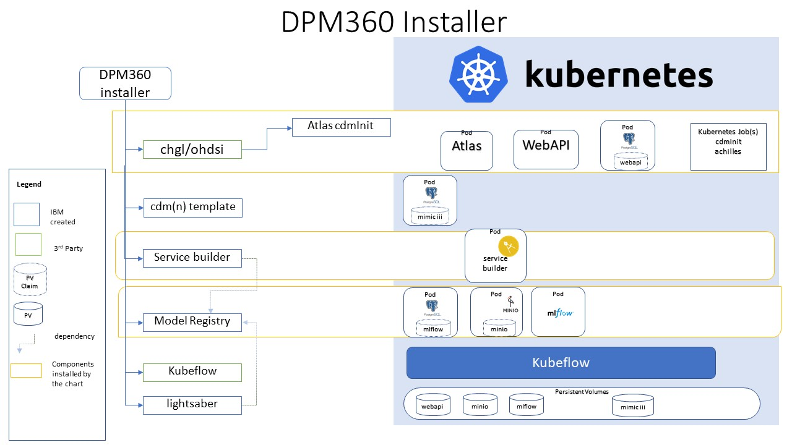

# DPM 360

The **Installer** component installs the fully functional DPM60 into Kubernetes or OpenShift Container Platform using [Helm charts](https://helm.sh/). Upon installation, models for different endpoints are available for the user. Helm Charts are simply Kubernetes manifests combined into a single package that can be installed to Kubernetes clusters. Once packaged, installing a Helm Chart into a cluster is as easy as running a single helm install, which really simplifies the deployment of containerized applications.

## Design of DPM360 Installer

## Prerequisites

* Kubernetes v1.18+
* Helm v3
* Persistent Volume claims for Postgres Database ( Refer to the Configuration section in each of the charts)

## Installing the Chart

Step 1:  Install the OHDSI Stack by following the instructions [here](https://github.ibm.com/IBM-Research-AI/dpm360/tree/master/installer/ohdsi-stack) .  This will install the OHDSI components ( Atlas, WebAPI, a Postgres Database, and Achilles)

Step 2: Install the Model Registry by following the instructions [here](https://github.ibm.com/IBM-Research-AI/dpm360/tree/master/installer/model-registry) .  This will install Mlflow with a Postgres and Minio backend.
