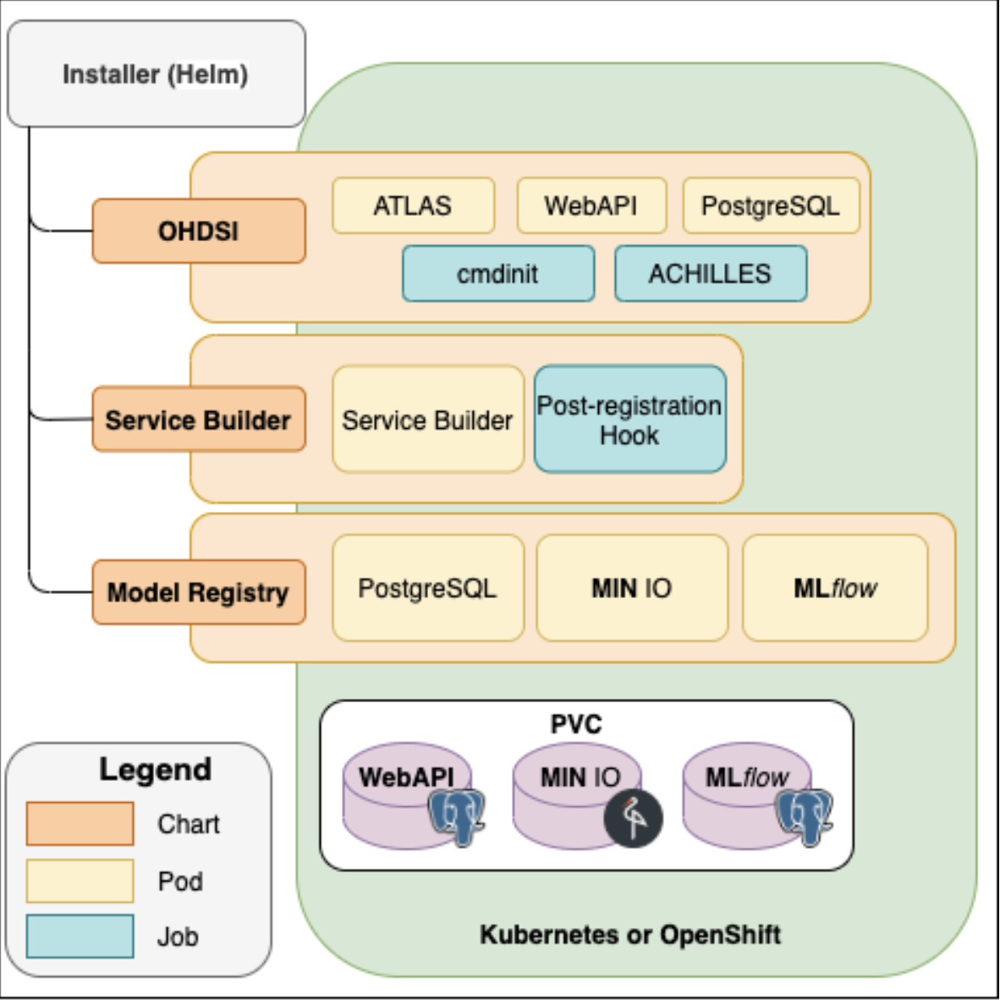

# Installer
The **Installer** component installs the fully functional DPM60 into Kubernetes or OpenShift Container Platform using [Helm charts](https://helm.sh/). Upon installation, models for different endpoints are available for the user. Helm Charts are simply Kubernetes manifests combined into a single package that can be installed to Kubernetes clusters. Once packaged, installing a Helm Chart into a cluster is as easy as running a single helm install, which really simplifies the deployment of containerized applications.

<figure><center><figcaption>DPM360 Installer</figcaption></center></figure>

<br />
<br />

You may follow the detailed instructions or skip to the last section and use express installation scripts. You also follow **[non-cloud-cluster setup](non_cluster_install.md)** if you want to try OHDSI stack without using a cluster.

## **Step 1:  Install the OHDSI Stack by following the instructions below.  This will install the OHDSI components ( Atlas, WebAPI, a Postgres Database, and Achilles)**

## DPM360 - OHDSI stack installer

This chart is an adaptation of chart listed by [chgl/ohdsi](https://github.com/chgl/charts/tree/master/charts/ohdsi)

A sample values.yaml file is provided in the repository [here](https://github.ibm.com/IBM-Research-AI/dpm360/blob/master/installer/ohdsi-stack/values.yaml).

## Introduction

This chart deploys the OHDSI WebAPI and ATLAS app. on a [Kubernetes](http://kubernetes.io) cluster using the [Helm](https://helm.sh) package manager.

##

## Prerequisites

* Kubernetes v1.18+
* Helm v3
* Persistent Volume claims for Postgres Database ( Refer to the Configuration section below)

##

## Installing the Chart

To install the chart with the release name `ohdsi`:

```
$ helm repo add chgl https://chgl.github.io/charts
$ helm repo update
$ helm install ohdsi chgl/ohdsi -n <your workspace> --values values.yaml
```

The command deploys the OHDSI WebAPI and ATLAS app. on the Kubernetes cluster in the default configuration. The [configuration](https://github.com/chgl/charts/tree/master/charts/ohdsi#configuration) section lists the parameters that can be configured during installation.

> **Tip**: List all releases using `helm list`


## Uninstalling the Chart

To uninstall/delete the `ohdsi`:

<pre>$ <span class="pl-s1">helm delete ohdsi -n ohdsi</span></pre>

The command removes all the Kubernetes components associated with the chart and deletes the release.


## Configuration

The following table lists the configurable parameters of the `ohdsi` chart and their default values.


| Parameter | Description | Default |
| - | - | - |
| imagePullSecrets | image pull secrets used by all pods | `[]` |
| nameOverride | partially override the release name | `""` |
| fullnameOverride | fully override the release name | `""` |
| commonAnnotations | annotations applied to all deployments and jobs | `[]` |
| postgresql.enabled | enable an included PostgreSQL DB. if set to`false`, the values under `webApi.db` are used | `true` |
| postgresql.postgresqlDatabase | name of the database to create see:[https://github.com/bitnami/bitnami-docker-postgresql/blob/master/README.md#creating-a-database-on-first-run](https://github.com/bitnami/bitnami-docker-postgresql/blob/master/README.md#creating-a-database-on-first-run) | `"ohdsi"` |
| postgresql.existingSecret | Name of existing secret to use for PostgreSQL passwords. The secret has to contain the keys`postgresql-password` which is the password for `postgresqlUsername` when it is different of `postgres`, `postgresql-postgres-password` which will override `postgresqlPassword`, `postgresql-replication-password` which will override `replication.password` and `postgresql-ldap-password` which will be sed to authenticate on LDAP. The value is evaluated as a template. | `""` |
| postgresql.replication.enabled | should be true for production use | `false` |
| postgresql.replication.readReplicas | number of read replicas | `2` |
| postgresql.replication.synchronousCommit | set synchronous commit mode: on, off, remote_apply, remote_write and local | `"on"` |
| postgresql.replication.numSynchronousReplicas | from the number of`readReplicas` defined above, set the number of those that will have synchronous replication | `1` |
| postgresql.metrics.enabled | should also be true for production use | `false` |
| webApi.enabled | enable the OHDSI WebAPI deployment | `true` |
| webApi.replicaCount | number of pod replicas for the WebAPI | `1` |
| webApi.db.host | database hostname | `"host.example.com"` |
| webApi.db.port | port used to connect to the postgres DB | `5432` |
| webApi.db.database | name of the database inside. If postgresql.enabled=true, then postgresql.postgresqlDatabase is used | `"ohdsi"` |
| webApi.db.username | username used to connect to the DB. Note that this name is currently used even if postgresql.enabled=true | `"postgres"` |
| webApi.db.password | the database password. Only used if postgresql.enabled=false, otherwise the secret created by the postgresql chart is used | `"postgres"` |
| webApi.db.existingSecret | name of an existing secret containing the password to the DB. | `""` |
| webApi.db.existingSecretKey | name of the key in`webApi.db.existingSecret` to use as the password to the DB. | `"postgresql-postgres-password"` |
| webApi.db.schema | schema used for the WebAPI's tables. Also referred to as the "OHDSI schema" | `"ohdsi"` |
| webApi.podAnnotations | annotations applied to the pod | `{}` |
| webApi.cors.enabled | whether CORS is enabled for the WebAPI. Sets the`security.cors.enabled` property. | `false` |
| webApi.cors.allowedOrigin | value of the`Access-Control-Allow-Origin` header. Sets the `security.origin` property. set to `*` to allow requests from all origins. if `cors.enabled=true`, `cors.allowedOrigin=""` and `ingress.enabled=true`, then `ingress.hosts[0].host` is used. | `""` |
| webApi.podSecurityContext | security context for the pod | `{}` |
| webApi.service | the service used to expose the WebAPI web port | `{"port":8080,"type":"ClusterIP"}` |
| webApi.resources | resource requests and limits for the container.<br/> 2Gi+ of RAM are recommended ([https://github.com/OHDSI/WebAPI/issues/1811#issuecomment-792988811](https://github.com/OHDSI/WebAPI/issues/1811#issuecomment-792988811)) <br/> You might also want to use `webApi.extraEnv` to set `MinRAMPercentage` and `MaxRAMPercentage`: <br/> Example: <br/> `helm template charts/ohdsi \` <br/> `--set webApi.extraEnv[0].name="JAVA_OPTS" \` <br/> `--set webApi.extraEnv[0].value="-XX:MinRAMPercentage=60.0 -XX:MaxRAMPercentage=80.0"` | `{}` |
| webApi.nodeSelector | node labels for pods assignment see:[https://kubernetes.io/docs/user-guide/node-selection/](https://kubernetes.io/docs/user-guide/node-selection/) | `{}` |
| webApi.tolerations | tolerations for pods assignment see:[https://kubernetes.io/docs/concepts/configuration/taint-and-toleration/](https://kubernetes.io/docs/concepts/configuration/taint-and-toleration/) | `[]` |
| webApi.affinity | affinity for pods assignment see:[https://kubernetes.io/docs/concepts/configuration/assign-pod-node/#affinity-and-anti-affinity](https://kubernetes.io/docs/concepts/configuration/assign-pod-node/#affinity-and-anti-affinity) | `{}` |
| webApi.extraEnv | extra environment variables | `[]` |
| atlas.enabled | enable the OHDSI Atlas deployment | `true` |
| atlas.replicaCount | number of replicas | `1` |
| atlas.webApiUrl | the base URL of the OHDSI WebAPI, e.g.[https://example.com/WebAPI](https://example.com/WebAPI) if this value is not set but `ingress.enabled=true` and `constructWebApiUrlFromIngress=true`, then this URL is constructed from `ingress` | `""` |
| atlas.constructWebApiUrlFromIngress | if enabled, sets the WebAPI URL to`http://ingress.hosts[0]/WebAPI` | `true` |
| atlas.podAnnotations | annotations for the pod | `{}` |
| atlas.podSecurityContext | security context for the pod | `{}` |
| atlas.service | the service used to expose the Atlas web port | `{"port":8080,"type":"ClusterIP"}` |
| atlas.resources | resource requests and limits for the container | `{}` |
| atlas.nodeSelector | node labels for pods assignment see:[https://kubernetes.io/docs/user-guide/node-selection/](https://kubernetes.io/docs/user-guide/node-selection/) | `{}` |
| atlas.tolerations | tolerations for pods assignment see:[https://kubernetes.io/docs/concepts/configuration/taint-and-toleration/](https://kubernetes.io/docs/concepts/configuration/taint-and-toleration/) | `[]` |
| atlas.affinity | affinity for pods assignment see:[https://kubernetes.io/docs/concepts/configuration/assign-pod-node/#affinity-and-anti-affinity](https://kubernetes.io/docs/concepts/configuration/assign-pod-node/#affinity-and-anti-affinity) | `{}` |
| atlas.extraEnv | extra environment variables | `[]` |
| atlas.config.local | this value is expected to contain the config-local.js contents | `""` |
| cdmInitJob.enabled | if enabled, create a Kubernetes Job running the specified container see[cdm-init-job.yaml](https://github.com/chgl/charts/blob/master/charts/ohdsi/templates/cdm-init-job.yaml) for the env vars that are passed by default | `false` |
| cdmInitJob.image | the container image used to create the CDM initialization job | `{"pullPolicy":"Always","registry":"docker.io","repository":"docker/whalesay","tag":"latest"}` |
| cdmInitJob.podAnnotations | annotations set on the cdm-init pod | `{}` |
| cdmInitJob.podSecurityContext | PodSecurityContext for the cdm-init pod | `{}` |
| cdmInitJob.securityContext | ContainerSecurityContext for the cdm-init container | `{}` |
| cdmInitJob.extraEnv | extra environment variables to set | `[]` |
| achilles.enabled | whether or not to enable the Achilles cron job | `true` |
| achilles.schedule | when to run the Achilles job. See[https://kubernetes.io/docs/concepts/workloads/controllers/cron-jobs/#cron-schedule-syntax](https://kubernetes.io/docs/concepts/workloads/controllers/cron-jobs/#cron-schedule-syntax) | `"@daily"` |
| achilles.schemas.cdm | name of the schema containing the OMOP CDM. Equivalent to the Achilles`ACHILLES_CDM_SCHEMA` env var. | `"synpuf_cdm"` |
| achilles.schemas.vocab | name of the schema containing the vocabulary. Equivalent to the Achilles`ACHILLES_VOCAB_SCHEMA` env var. | `"synpuf_vocab"` |
| achilles.schemas.res | name of the schema containing the cohort generation results. Equivalent to the Achilles`ACHILLES_RES_SCHEMA` env var. | `"synpuf_results"` |
| achilles.cdmVersion | version of the CDM. Equivalent to the Achilles`ACHILLES_CDM_VERSION` env var. | `"5.3.1"` |
| achilles.sourceName | the CDM source name. Equivalent to the Achilles`ACHILLES_SOURCE` env var. | `"synpuf-5.3.1"` |
| ingress.enabled | whether to create an Ingress to expose the Atlas web interface | `false` |
| ingress.annotations | provide any additional annotations which may be required. Evaluated as a template. | `{}` |
| ingress.tls | ingress TLS config | `[]` |
| `CDM_URL` | Location of Athena Vocabulary file in tar.gz format.  It could be either a s3 url or a local file. All necessary vocabulary files can be downloaded from the ATHENA download site: http://athena.ohdsi.org. A tutorial for Athena is available at https://www.youtube.com/watch?v=2WdwBASZYLk  |   |
| `SYNPUF1K_URL` | Location of Synthetic 1K data file in tar.gz format.  It could be either a s3 url or a local file.  You can download this from[here](https://caruscloud.uniklinikum-dresden.de/index.php/s/teddxwwa2JipbXH/download). |   |
| `RESULTS_TABLE_URL` | This will be the URL to get the Results schema.<br />Example:<br />http://[server:port](server:port)/WebAPI/ddl/results?dialect=<your_cdm_database_dialect>&schema=<your_results_schema>&vocabSchema=<your_vocab_schema>&tempSchema=<your_temp_schema>&initConceptHierarchy=true |   |
| `CDM_SCHEMA` | Value of the CDM_SCHEMA in your CDM Database |   |
| `OHDSI_WEBAPI_SCHEMA` | Value of the WebAPI Schema in your database |   |
| `RESULTS_SCHEMA` | Value of Results Schema in your daabase |   |
| `TEMP_SCHEMA` | Value of Temp schema in your database |   |
|   |   |   |
|   |   |   |

Specify each parameter using the `--set key=value[,key=value]` argument to `helm install`. For example:

<pre>$ <span class="pl-s1">helm install ohdsi chgl/ohdsi -n ohdsi --set postgresql.postgresqlDatabase=<span class="pl-s"><span class="pl-pds">"</span>ohdsi<span class="pl-pds">"</span></span></span></pre>

Alternatively, a YAML file that specifies the values for the parameters can be provided while
installing the chart. For example:

<pre>$ <span class="pl-s1">helm install ohdsi chgl/ohdsi -n ohdsi --values values.yaml</span></pre>

##

## Initialize the CDM using a custom container

1. A custom docker image to initialize the CDM database with Athena Vocabularies and Synthetic 1K patient data is built based on the broad guidelines outlined [here](https://github.com/IBM/DPM360).
   This custom image is utilized in the cdmInitJob.image parameter in the values.yaml.

   The cdmInit container takes in the following parameters to initialize the data:

   `CDM_URL`Location of Athena Vocabulary file in tar.gz format.  It could be either a s3 url or a local file. All necessary vocabulary files can be downloaded from the ATHENA download site: http://athena.ohdsi.org. A tutorial for Athena is available at https://www.youtube.com/watch?v=2WdwBASZYLk . `SYNPUF1K_URL`Location of Synthetic 1K data file in tar.gz format.  It could be either a s3 url or a local file.  You can download this from[here](https://caruscloud.uniklinikum-dresden.de/index.php/s/teddxwwa2JipbXH/download). ` RESULTS_TABLE_URL`This will be the URL to get the Results schema.
   Example:
   http://[server:port](server:port)/WebAPI/ddl/results?dialect=<your_cdm_database_dialect>&schema=<your_results_schema>&vocabSchema=<your_vocab_schema>&tempSchema=<your_temp_schema>&initConceptHierarchy=true

   `CDM_SCHEMA` Name of the schema that contains the CDM tables in your database.

   `OHDSI_WEBAPI_SCHEMA` Name of the schema that contains the WebAPI tables in your database.

   `RESULTS_SCHEMA`Name of the schema that contains the results tables in your database.
   `TEMP_SCHEMA` Name of the schema that contains the temp results table in your database.

## Troubleshooting

If the deployment does not work, possible todo following this https://www.kubeflow.org/docs/started/workstation/minikube-linux/


## **Step 2: Install the Model Registry by following the instructions below.  This will install Mlflow with a Postgres and Minio backend.**

## MLFlow and dependcies

[DPM360](https://github.com/ibm/dpm360) - Helm chart for deploying Disease progression model framework including OHDSI tools ( Atlas, WebAPI), MLFlow and its dependencies ( minio for object storage and postgresql for relational database).

## Pre-requisites

```console
Download the chart repo
In your cloud environment, create 3 persistent volume claims ( one for OHDSI postgres, one for minio-mlflow and one for postgres-mlflow)
Update the values.yaml with paramters matching your cloud environment


```

## Introduction

This chart deploys the MLFlow along with a minio based storage and postgesql database on a [Kubernetes](http://kubernetes.io) cluster using the [Helm](https://helm.sh) package manager.

## Prerequisites

- Kubernetes v1.18+
- Helm v3

## Installing the Chart

```console
Once you have cloned the repo (https://github.com/IBM/DPM360)

$ cd to the folder where you have installer/
$ helm install modelregistry ./model-registry -n <your namespace> --values ./model-registry/values.yaml
This will create 3 deployments in your kubernetes cluster ( mlflow, minio and postgresql)

Update your ingress to allow access to the services created by the helm chart.

```

The command deploys the MLFlow (version 1.14.1) along with minio for storage and postgresql on the Kubernetes cluster in the default configuration. The [configuration](#configuration) section lists the parameters that can be configured during installation.

> **Tip**: List all releases using `helm list`

## Uninstalling the Chart

To uninstall/delete the `modelregistry`:

```console
$ helm delete modelregistry -n <yournamespace>
```

The command removes all the Kubernetes components associated with the chart and deletes the release.

## Configuration

The following table lists the configurable parameters of the `model-registry` chart and their default values.


| Parameter | Description | Default |
| - | - | - |
| MINIO | This section is for minio configuration |   |
| minio.image | minio images used for this installation | `""` |
| minio.accessKey | access key ( usename) required by minio | `""` |
| minio.secretKey | secret key required by minio | `[]` |
| minio.rootuser | minio console user | `""` |
| minio.rootpassword | minio console user password | `""` |
| minio.resources | section used to configure your pod memory and cpu settings | `""` |
| minio.persistence | This section specifies the PVC that you had created a part of the pre-requisites | `true` |
| minio.container port | container port ( typically set to 9000) | `9000` |
| minio.httpport | port that is exposed in your service specification. Typcially set to 9000 | `"9000"` |
|   |   |   |
| Postgres for MLFlow | This section describes Postgres for MLFlow configuration |   |
| pgmlflow.enabled | enable the postgres deployment for mlflow | `true` |
| pgmlflow.image | postgres images used ( 12.5 in this example) | `1` |
| pgmlflow.POSTGRES_USER | postgres user used for the installation | `"postgres"` |
| pgmlflow.POSTGRES_PASSWORD | password for the postgres user | `postgres` |
| pgmlflow.resources | use this section to specify the pod memery and cpu limits | `""` |
| pgmlflow.containerport | container port for postgres db | `"5432"` |
| pgmlflow.httpport | port for running the postgres service.  If you have multiple postgres instances, this will be different from the container port | `"5452"` |
|   |   |   |
| MLFlow | This section lists the configuration for MLFlow |   |
| mlflow.enabled | enable the mlflow for this deployment | `"true"` |
| mlflow.image | specifies the mlflow image used | `{}` |
| mlflow.MLFLOW_HOST | MLFlow host name | `` |
| mlflow.BACKEND_STORE_URI | datastore used for backend.  In our case we have used postgresql | `""` |
| mlflow.POSTGRES_HOST | postgres service name | `{}` |
| mlflow.MINIO_HOST | minio endpoint that will be exposed by the ingress | `{}` |
| mlflow.MLFLOW_TRACKING_URI | mlflow endpoit that will exposed by the ingress | `{}` |
| mlflow.MLFLOW_S3_ENDPOINT_URL | minio endpoint that will be exposed by the ingress. | `{}` |
|   |   |   |
| mlflow.AWS_ACCESS_KEY_ID | minio user id | `{}` |
| mlflow.AWS_SECRET_ACCESS_KEY | minio access key for the user | `[]` |
| mlflow.AWS_MLFLOW_BUCKET_NAME<br />mlflow.AWS_BUCKET  / AWS_MLFLOW_BUCKET | name of the bucket used for mlflow experiments<br /> | `mlflow-experiments` |
| mlflow.resources | use this section to define the memory and cpu for the pod | `1` |
| mlflow.containerport | port number of the container. Typically it is 5000 | `"9000"` |
| mlflow.httpport | port number that the service listens.  Typically same as containerport | `"9000"` |
|   |   |   |
|   |   |   |
|   |   |   |

Specify each parameter using the  YAML file that specifies the values for the parameters while installing the chart. For example:

```console
$ helm install modelregistry ./model-registry -n <your namespace> --values ./model-registry/values.yaml
```

## Express Installation Script

### Prerequisites

* Kubernetes v1.18+
* Helm v3

### Installing the Chart
* Update `installer/1-cluster-get-context.sh` with your k8s config / cloud cli login
* Use find and replace feature in your favorite dev tool to replace `<external link>` string in config files with real cluster endpoint. This needs to be done for all files in installer folder (except docs). Example cluster endpoint: `dpm360-2-9ca4d14d48413d18ce61b80811ba4308-0000.us-south.containers.appdomain.cloud` (no quotes or https). This endpoint varies based on your cloud provider.
* Similarly, replace `<secret - implementation may depend on cloud provider>` with the secret provided by your cloud provider. For demo cluster our secret name is: `dpm360-2-9ca4d14d48413d18ce61b80811ba4308-0000`. To generate secret in IBM cloud following steps may be helpful:

    * Make sure to install ks plugin if not installed 
    
        `ibmcloud plugin install container-service`

    * Get current secret's CRN
    
        `ibmcloud ks ingress secret get -c <cluster> --name <secret_name> --namespace default`

         eg. `ibmcloud ks ingress secret get -c c363nc6d0rggvcphtom0 --name dpm360-2-1ca4d14d48413d18ce61b80811ba4308-0000 --namespace default  | grep crn`

         CRN: `crn:v1:bluemix:public:cloudcerts:us-south:a/045077ab9f1a4dcfafa2c58389d3e639:daf653b8-467a-4ffa-a38e-a4d2c2aa8990:certificate:bf042354f07903169fc0a6aab2ca0cc1`   

    * Create a copy of secret to new namespace

        `ibmcloud ks ingress secret create --cluster <cluster_name_or_ID> --cert-crn <CRN> --name <secret_name> --namespace <namespace>`
    
         eg. `ibmcloud ks ingress secret create --cluster c363nc6d0rggvcphtom0 --cert-crn crn:v1:bluemix:public:cloudcerts:us-south:a/045077ab9f1a4dcfava2c58389d3d639:daf653b8-467a-4ffa-a38e-a4d2c2aa8390:certificate:bf042354f07903149f20a6aab2ca0cc1 --name dpm360-2-1ca4d14d48413d18ce61b80811ba4308-0000 --namespace ohdsi`

* Update `installer/service-builder/cronjob.yaml` with configs as suggested in `Setting up cron job(pre-registration hook)` section of service builder documentation

* After the config changes are complete, get k8s context and start the services
```
cd installer
sh 1-cluster-get-context.sh
sh 2-cluster-run-services.sh
```

* Go to k8s dashboard to verify if deployment, services and ingress are healthy. If you are using IBM Cloud, you will get dashboard link through  https://cloud.ibm.com/kubernetes/clusters 

* To ETL, vocab and data file should be accessible to the job. Please upload it to object storage or minio. You may pass API_KEY if files are saved in IBM cloud object storage. 
* [Not preferred way] If you don't want to save it to cloud object storage, you may choose minio method. Use `minio.<external link>` to access files using web browser.
    * create bucket: mlflow-experiments with read & write priviledges  OR use following script
```
sh ohdsi-stack/minio-upload.sh <username> <password> <data_folder>
eg. sh ohdsi-stack/minio-upload.sh minioRoot minioRoot123 ~/Downloads
```

* Update `CDM_URL` and `SYNPUF1K_URL` in `installer/ohdsi-stack/synpuf1k-etl.yaml`. If files are not publicly accesible, `API_KEY` is also required in the same yaml file. Data can be loaded using the following cmd. 
```
sh 3-cluster-load-data.sh
```
