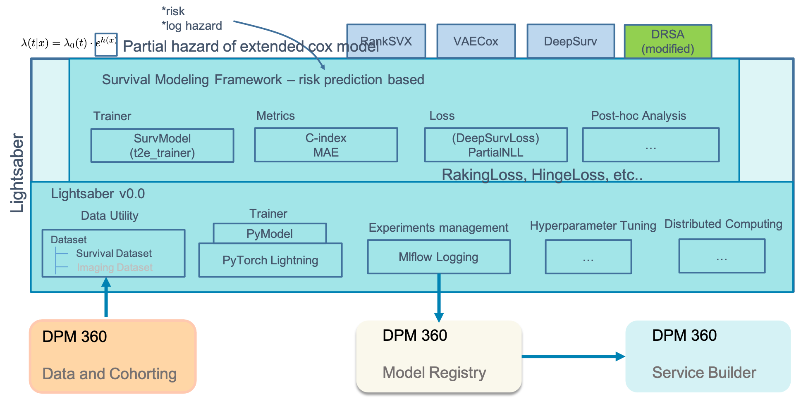

# Why use lightsaber

**Architectural Overview**

In this example, Lightsaber packages the core for model training, experiments management, dataset ingestion, hyper-parameter tuning, and ad-hoc distributed computing. Survival modeling, now a part of lightsaber, provides the flavor of lightsaber that uses concepts to provide specialized capabilities such as model trainer (including loss functions) and metrics for time-to-event modeling. With this core, models such as RankSVX and VAECox only implements the network architecture and specifies the loss function without spending so much time around training and optimizing the model.

Lightsaber is a common model training and evaluation framework that caters to primarily 2 personas: (a) data scientists and (b) researchers. 

W/o Lightsaber, for each model and datasets, we have to write our own custom training routines (more important for deep learning models as base Pytorch is quite low-level for that), custom data processors to ingest data from extracted cohort (again more important for deep learning models), and inbuilt model tracking using Mlflow (this is valid for both sklearn and Pytorch). Also, w/o Lightsaber for every model and type of model we have to use in custom manner metrics and evaluations - Lightsaber standardizes and integrates that - e.g. for a classification mode we track AUC-ROC, AUC-PROC, Recall@K, etc. Lightsaber also integrates recalling such evaluations for post-hoc report generation and/or model maintenance by providing routines to interact with Mlflow. w/o lightsaber all of these need to (a) be custom built and (b) be repeated for each model.

It also provides additional built-in utilities such as calibration of the model. Indeed to develop and test a new deep learning model, we need to code:

1. Data ingestion across splits in a repeatable and standard manner
2. the network structure and the loss function
3.  the training framework to train the model on the training data and use the validation data for optimization of the model
4.  Apply techniques such as early stopping to prevent overfitting using the validation set
5.  tuning the model to find the optimal hyperparameters
6.  evaluating the model on the test data using different metrics
7.  saving and deploying the model for later use.

Lightsaber isolates all engineering parts of training the model [steps 1 and 3-6] from the core model development [step 2] so the researcher needs to only focus on the architecture of the network as well as the loss function. All other steps are provided by the lightsaber framework in a standarized way for training/optimizing/evaluating/deploying the model
