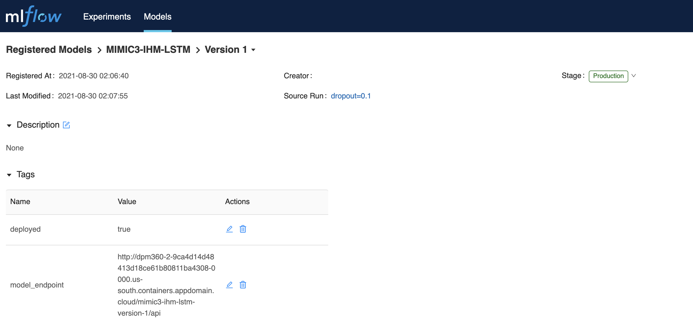
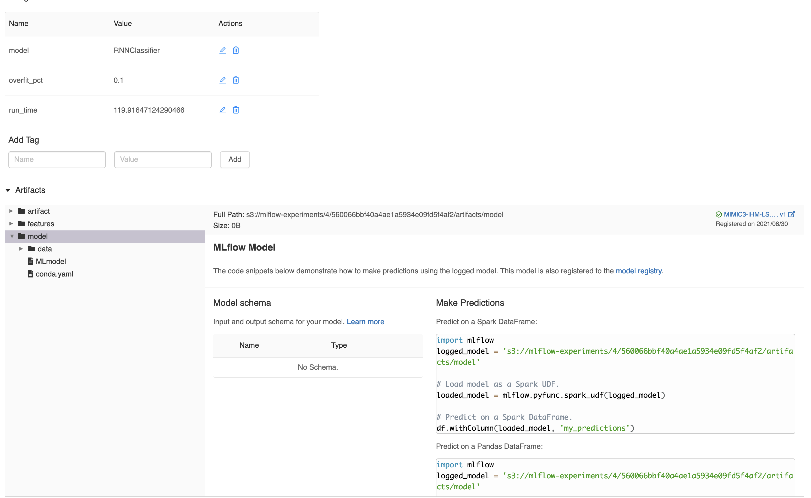

# Service Builder 

The Service Builder component is responsible for converting registered models into micro-services. It achieves this through a number of automated steps as shown in the diagram below.

**In Step 1:** The Service Builder comes with an inbuilt post-registration-hook in the form of a Cron job which is configured to listen for a deployment-ready model in the Model Registry. Identification of deployment-ready model is done using a “production” tag being set on the model within the registry e.g by the machine learning researcher or model creator. A registered model has metadata that includes the model binary file, its dependencies and related artifacts etc.

**In Step 2:** Upon finding a deployment-ready model in the registry, the post-registration-hook extracts model and its dependencies from the Model Registry and packages the model as a micro-service in a Docker container using a framework called “Model Wrapper”.

**In Step 3:** Upon successful packaging of the model as a container, the execution flow proceeds to model deployment in a target cloud cluster e.g. Kubernetes or OpenShift. The deployment process makes use of a base deployment image, Model Wrapper as well as the actual container created in the previous step. Upon successful deployment a callback function updates model metadata in the Model Registry with deployment status and model access endpoint.

**In Step 4:** Using the model endpoint, potential users (e.g data scientist or product managers, etc.) can interact with the model, now deployed as a microservice, though a Swagger-based interface. In the interface they provide inputs to the model e.g., a patient id, which is then passed to the model for prediction, and a response is returned to the user.

<figure><center><figcaption>Service Builder Architecture</figcaption></center></figure>

# Setting up Service Builder Pipeline
This section provides details on how one can setup the service builder pipeline in their cluster.

## Prerequisites
* Kubernetes v1.18+
* Python 3
* Docker

## Setting up Cron Job(Pre-registration Hook)
 From the [DPM360 root folder](https://github.ibm.com/IBM-Research-AI/dpm360) navigate to [service builder folder](https://github.ibm.com/IBM-Research-AI/dpm360/tree/dev/service_builder) and follow the following steps to setup the pre-registration hook cron job service. 
 
**Step 1 (Optional):**  The cron job service comes with a pre-built base docker image which can be replaced. To replace the base image you can build a new one using the following command while inside the [cron job folder](https://github.ibm.com/IBM-Research-AI/dpm360/tree/dev/service_builder/cron_job).

```
docker build -t dpm360-cronjob .
```
Upon a successful image build, you can proceed to tag the image with a preferred name and push the image to a container registry of you choice. The sample commands below are used to push the image to DPM360 docker hub space. NB: Depending on the chosen registry one may have to set permissions to access the image, the current base image is stored in docker hub which does not require permissions for one to pull/access the image. 


```
docker  tag dpm360-cronjob ibmcom/dpm360-cronjob   
docker  push ibmcom/dpm360-cronjob
```  

**Step 2 (Optional):** If you have built a new image and pushed to a different registry ensure that the new image tag is updated in the [cron job deployment file](https://github.ibm.com/IBM-Research-AI/dpm360/blob/dev/service_builder/cron_job/cronjob.yaml#L15).
  
**Step 3:** Update the [cron job deployment file](https://github.ibm.com/IBM-Research-AI/dpm360/blob/dev/service_builder/cron_job/cronjob.yaml) with needed environment variables. These variables are outlined below with representation explanation details given. These environment variables include details for a Model Registry(e.g. [Mflow](https://mlflow.org/)) which is used to retrieve deployment ready models to be deployed to a kubernetes cluster. These variables also include env variables for the target cluster(e.g. Kubernetes or OpenShift).

```
       - name: MLFLOW_API
         value: <YOUR_VALUE_HERE> --->  Represents model registry end points
       - name: K8s_CLUSTER
         value: <YOUR_VALUE_HERE> --->  Represents K8S cluster name
       - name: K8S_API_KEY
         value: <YOUR_VALUE_HERE> --->  Represents K8S cluster key
       - name: K8S_API
         value: <YOUR_VALUE_HERE> --->  Represents K8S cluster API
       - name: K8S_NAME_SPACE
         value: <YOUR_VALUE_HERE> ---> Represents K8S cluster project name
       - name: DPM360_SERVICE_BUILDER_HOST_NAME
         value: <YOUR_VALUE_HERE> ---> Represents service builder host name(more details in updating model wrapper section below)
       - name: MLFLOW_TRACKING_URI
         value: <YOUR_VALUE_HERE> ---> Represents model registry  tracking uri
       - name: MLFLOW_S3_ENDPOINT_URL
         value: <YOUR_VALUE_HERE> ---> Represents model registry s3 endpoint uri
       - name: AWS_SECRET_ACCESS_KEY
         value: <YOUR_VALUE_HERE> ---> Represents model registry s3 secret access key
       - name: AWS_ACCESS_KEY_ID
         value: <YOUR_VALUE_HERE> ---> Represents model registry s3 secret access id
```

NB: [Cron job scheduler](https://github.ibm.com/IBM-Research-AI/dpm360/blob/dev/service_builder/cron_job/cronjob.yaml#L6) can also be updated, by default the scheduler is set to check for ready models in the model registry after every 2 minutes.
  
**Step 4:** In the target kubernetes cluster set up a cron job service using [cron job deployment file](https://github.ibm.com/IBM-Research-AI/dpm360/blob/dev/service_builder/cron_job/cronjob.yaml) after updating the values described in step 2 above. Details of creating a cron job for kubernetes cluster via the dashboard can be found [here](https://kubernetes.io/docs/tasks/job/automated-tasks-with-cron-jobs/). To create the cron job via command line, login to Kubernetes/OpenShift and run the following commands to start the cron  job. 

 
```
oc apply -f cron_job/cronjob.yaml  ---> OpenShift Specific

or

kubectl apply -f cron_job/cronjob.yaml  ---> Kubernetes Specific
```
 
**Step 5:**  Once the cron job has been setup, it uses an [executor](https://github.ibm.com/IBM-Research-AI/dpm360/blob/dev/service_builder/cron_job/execute.sh) to fetch the model and deploy the model to a given cluster. The deployment process uses the following kubernetes controller templates [Deployment](https://github.ibm.com/IBM-Research-AI/dpm360/blob/dev/service_builder/cron_job/deployment_template.yaml), [Service](https://github.ibm.com/IBM-Research-AI/dpm360/blob/dev/service_builder/cron_job/service_template.yaml) and [Ingress](https://github.ibm.com/IBM-Research-AI/dpm360/blob/dev/service_builder/cron_job/ingress_template.yaml), the details of the different kubernetes controllers can be found [here](https://kubernetes.io/docs/concepts/). The templates are first updated with the relevant details either from the values set in the [cron job deployment file](https://github.ibm.com/IBM-Research-AI/dpm360/blob/dev/service_builder/cron_job/cronjob.yaml) or from the model registry metadata. Thereafter, these files are then used for model deployment and generation of the model's swagger endpoint. With every successful model deployment the [executor](https://github.ibm.com/IBM-Research-AI/dpm360/blob/dev/service_builder/cron_job/execute.sh) also updates model registry with the deployed model swagger endpoint. 

**NB:** To test the [executor](https://github.ibm.com/IBM-Research-AI/dpm360/blob/dev/service_builder/cron_job/execute.sh) script locally, you can export the needed environment variables as outlined in the [cron job deployment file](https://github.ibm.com/IBM-Research-AI/dpm360/blob/dev/service_builder/cron_job/cronjob.yaml) and run the [executor](https://github.ibm.com/IBM-Research-AI/dpm360/blob/dev/service_builder/cron_job/execute.sh) as a bash script. This approach is useful in debugging to ensure that the [executor](https://github.ibm.com/IBM-Research-AI/dpm360/blob/dev/service_builder/cron_job/execute.sh) script works as expected.
 

## Updating the Model Wrapper

From the [DPM360 root folder](https://github.ibm.com/IBM-Research-AI/dpm360) navigate to the [service builder folder](https://github.ibm.com/IBM-Research-AI/dpm360/tree/dev/service_builder) and follow the following steps to update model wrapper base image. The model wrapper base image is responsible for serving a given model from model registry. It achieves this by using a pre-built docker image which is pre-packaged with required model dependencies. This base image and model dependencies can be updated by following the steps below.

**Step 1 :** Update any model dependencies needed in the [requirements file](https://github.ibm.com/IBM-Research-AI/dpm360/blob/dev/service_builder/requirements.txt). This file is used during the image build process for the model wrapper base image (see step 2 below). NB: Using a prepackaged base image with required dependencies improves the process of deploying new models as it skips building new docker images for every model.

**Step 2 :** Run the following command to build a new image with the updated requirements. 

```
docker build -t dpm360-service-builder -f service_builder/Dockerfile .
```

**Step 3 :** Tag and push the image to your preferred container registry. In the example below we are pushing to the [DPM360 docker hub registry](https://hub.docker.com/r/ibmcom).

```
docker build -t dpm360-service-builder -f service_builder/Dockerfile .
docker push ibmcom/dpm360-service-builder
```

**Step 4 :** After updating the model wrapper image, remember to update [model deployment file ](https://github.ibm.com/IBM-Research-AI/dpm360/blob/dev/service_builder/cron_job/deployment_template.yaml#L19) with the right image tag. If you have used a container registry that requires permissions to access image, you can also update the [model deployment file ](https://github.ibm.com/IBM-Research-AI/dpm360/blob/dev/service_builder/cron_job/deployment_template.yaml) with secrets needed to access the image. Examples of how to set private registry secrets in the deployment file can be found [here](https://kubernetes.io/docs/tasks/configure-pod-container/pull-image-private-registry/)

## Deploying a New Model Using Model Wrapper


Follow the following steps to deploy a production ready model from model registry. The example uses [Mflow](https://mlflow.org/)) model registry.

**Step 1 :** Setup a Mlflow model registry in your cluster and have the following cofiguration variables handy for the next steps. Please note that the variables naming style is based on [Mflow](https://mlflow.org/)) .

```
    MODEL_REGISTRY_API=<YOUR_VALUE_HERE>                     ---> Represents model registry end point
    MLFLOW_TRACKING_URI=<YOUR_VALUE_HERE>                    ---> Represents model registry  tracking uri              
    AWS_ACCESS_KEY_ID=<YOUR_VALUE_HERE>                      ---> Represents model registry s3 secret access key
    AWS_SECRET_ACCESS_KEY=<YOUR_VALUE_HERE>                  ---> Represents model registry s3 secret access id
    MLFLOW_S3_ENDPOINT_URL=<YOUR_VALUE_HERE>                 ---> Represents model registry s3 endpoint uri
```

**Step 2 :** Setup your Kubernetes/Openshift instance and follow the [instructions to set cron job](https://github.ibm.com/IBM-Research-AI/dpm360/tree/dev/service_builder#setting-up-cron-jobpre-registration-hook).

**Step 3 :** Having setup Mlflow model registry, Kubernetes/Openshift instance and the cron job is running you can now proceed to train a model. Model training can be done using [lighsaber](https://github.ibm.com/IBM-Research-AI/dpm360/tree/dev/lightsaber#welcome-to-lightsaber) which requires model registry cofiguration variables outlined in step 1 to register the model in the registry. A set of feature files which include [contract yaml]() and [test data]() are also registered alongside the model in the registry. These files are used by the model wrapper to ....  

**Step 4 :** After training a model you can proceed to Mlflow dashboard where you can tag a model version on your choice as production ready. Tagging a model as production ready makes it ready for the cron job to identify and deploy it as a micro-service. After some few minutes a set of new tags will be appended to existing model version which confirms that the model was succcessfully deployed. Example of the tags are shown in the image below



Using model_endpoint value one can access the deployed model swagger endpoint to start using model.

**Step 5 :** To test the image localy ensure that you have set the necessary environment variables which will be passed to the docker run command in step 6. The list of environment variables needed are shown below with explanations on what they represent. The image below shows an example of how one can get model source value to be used in the configurations below.



```
    MODEL_NAME=<YOUR_VALUE_HERE>                             ---> Represents model name from model registry
    MODEL_VERSION=1                                          ---> Represents model version from model registry
    MODEL_SOURCE=<YOUR_VALUE_HERE>                           ---> Represents model source from model registry e.g. s3://mlflow-experiments/0/81e4192736f8497384e09d6928ee0f2f/artifacts/model
    MODEL_RUN_ID=<YOUR_VALUE_HERE>                           ---> Represents model run id from model registry
    MODEL_REGISTRY_API=<YOUR_VALUE_HERE>                     ---> Represents model registry end point
    MLFLOW_TRACKING_URI=<YOUR_VALUE_HERE>                    ---> Represents model registry  tracking uri              
    AWS_ACCESS_KEY_ID=<YOUR_VALUE_HERE>                      ---> Represents model registry s3 secret access key
    AWS_SECRET_ACCESS_KEY=<YOUR_VALUE_HERE>                  ---> Represents model registry s3 secret access id
    MLFLOW_S3_ENDPOINT_URL=<YOUR_VALUE_HERE>                 ---> Represents model registry s3 endpoint uri
```


**Step 6 :**  Test the image locally in order to ensure that it works as expected by running the following docker run command.

```
docker run --p <YOUR_PORT_VALUE_HERE>:<YOUR_PORT_VALUE_HERE> -e PORT=<YOUR_PORT_VALUE_HERE> -e MLFLOW_S3_ENDPOINT_URL=<YOUR_VALUE_HERE> -e AWS_ACCESS_KEY_ID=<YOUR_VALUE_HERE> -e AWS_SECRET_ACCESS_KEY=<YOUR_VALUE_HERE> -e MODEL_NAME=<YOUR_VALUE_HERE> -e MODEL_VERSION=<YOUR_VALUE_HERE> -e MODEL_RUN_ID=<YOUR_VALUE_HERE> -e MLFLOW_TRACKING_URI=<YOUR_VALUE_HERE> -e MODEL_SOURCE=<YOUR_VALUE_HERE> -ti dpm360-service-builder
```

**Step 7 :** With a successful docker run in the step above, load the following endpoint in your browser to access the locally deployed model. NB: Replace MODEL_NAME with the exact value used above

```
http://0.0.0.0:8080/<MODEL_NAME>/api/
```    
